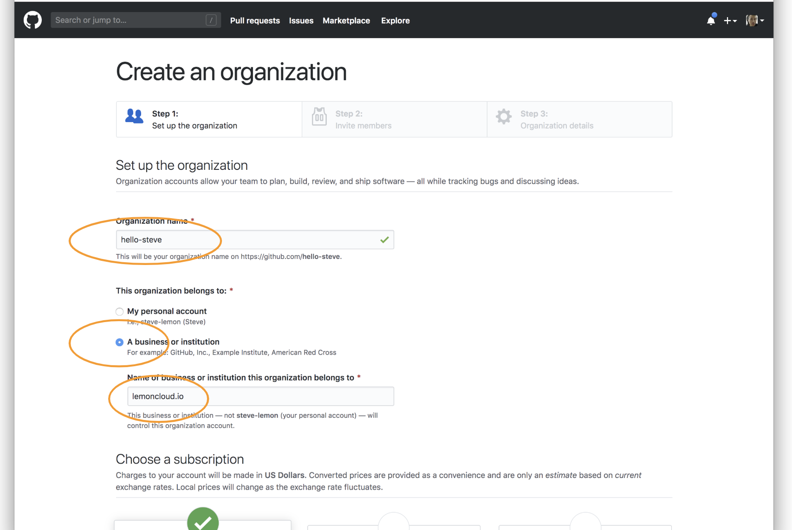

# 깃허브내 조직(Organization) 구성하기

조직을 설정하면, 팀별 권한등 다양한 기능 이용 가능

## 조직 생성

1. 개인별 깃허브 메인 페이지 이동 (예: `https://github.com/steve-lemon`)

1. 오른쪽위의 `+` 마크를 선택함

    

1. "New Organization"를 선택.

    

1. 다음과 같은 화면에서 "조직 이름" 과 "사업자 이름"을 입력

    - **Organization name** 에 조직(또는 프로젝트) 이름.
    - **A business or institution** 를 선택.
    - **Name of business** 에 사업체 이름 (주로 `Copyright`의 주체)

    

    - **Choose a subscription** 에서 오픈 소스 이므로 "Team For Open Source" 선택 (무료))

    

    - **Billing email** 에 깃헙 가입 이메일을 입력하고.
    - **Create organization** 선택하여 저장함.

    

1. **Step2** 에서 초기 초대할 멤버를 초대할 수 있음

    - `email`이나 `id` 로 검색후 **Invite** 버튼 클릭 (다음에 해도 됨)

    

1. **Step3** 에서 추가 정보 입력

    - **An open source project** 선택하고
    - **A year or more** 선택하고

    

    - 참여 인원 등 적절히 선택하고.
    - **Submit** 버튼으로 최종 생성.

    

## 추가 설정하기

좀 더 멋진 조직 화면을 제공하기 위해 꾸며 봅니다.

1. 초기 생성시 조직 화면에 접속 아래와 같음 (예: `https://github.com/hello-steve`)

    

    - **Settings** 를 선택하여 설정 구성 창으로.

1. 조직 상세 설명 추가

    - **Organization display name** 에 간략 설명 입력
    - **Description** 에 설명 추가
    - **Upload new picture** 로 조직 로고 설정.
    - **Update profile** 버튼 선택으로 최종 저장.

    

1. 이후, 조직 메인 화면 이동

    - 로고, 설명, 제목등 조직 설정이 변경 적용됨

    

    - 이후, **Create new repository** 로 신규 저장소 생성 가능.

## 기타 추가사항

N/A

