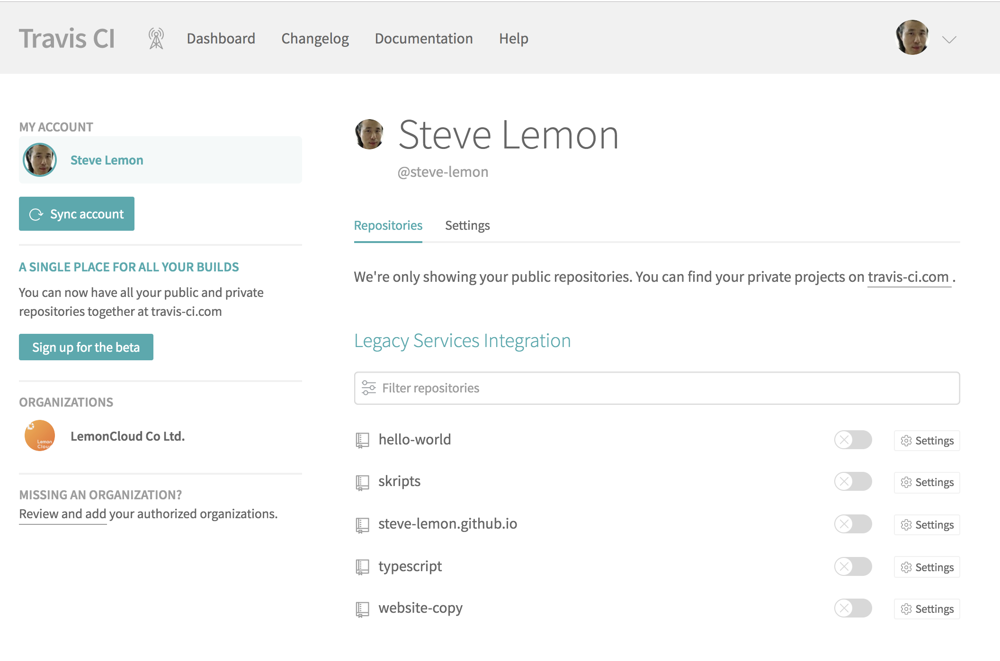

# Travis CI

Travis-CI는 루비로 작성된 오픈 소스 기반의 CI(Continuous Integration)

## Description

- 분산 CI 호스팅 서비스를 제공
- GitHub 아이디의 프로젝트를 연결하여 테스트, 빌드 및 배포 가능

## Installation

1. `https://travis-ci.org/auth` 에 접속

1. `Sign in with GitHub` 버튼 선택하고, github 아이디로 로그인.

    

1. Account Repositories 를 통해서 공개 저장소 확인

    

## Usage

각 저장소 별로 `.travis.yml` 파일 생성으로 시작.

1. `.travis.yml` 파일 생성하기

    ```yml

    ```

### References

- [complete CI environment for C and C++](https://github.com/ainfosec/ci_helloworld)

## Contributing

## Credits

## License

This project is licensed under the MIT License.
